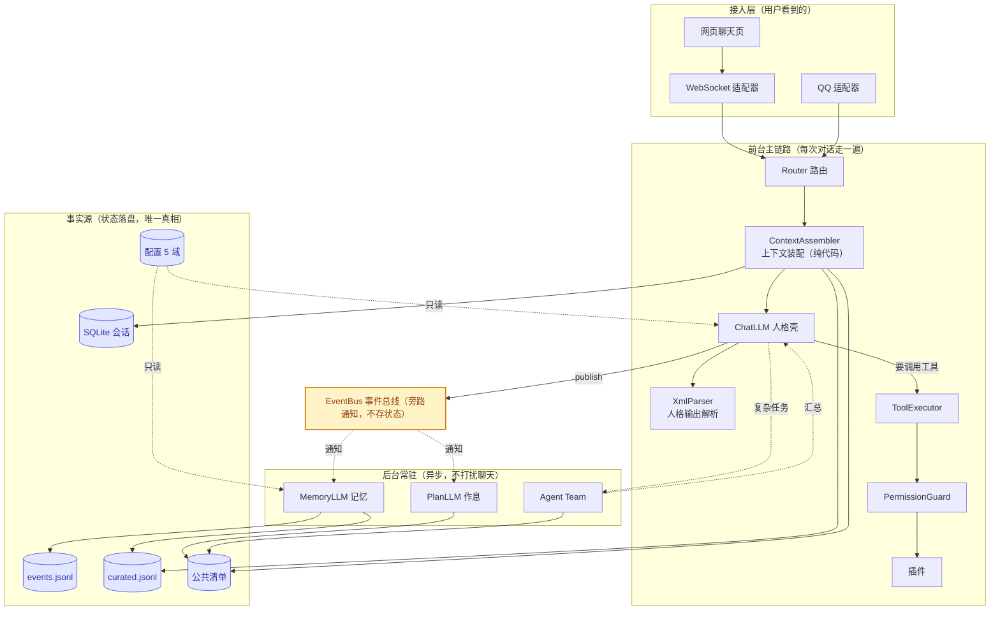
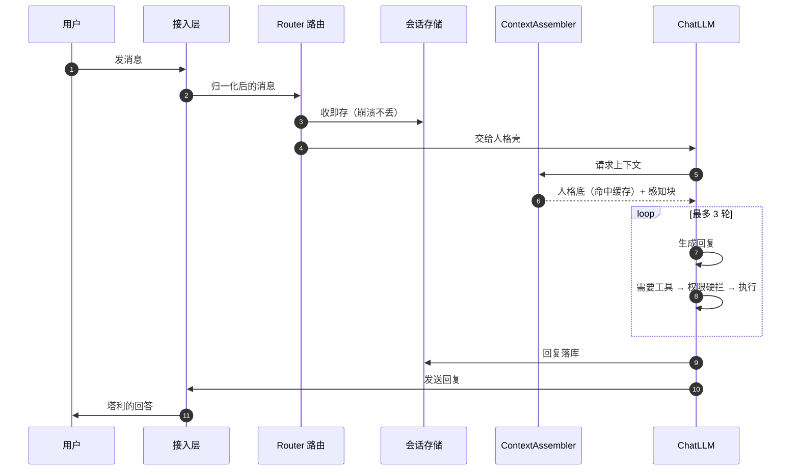
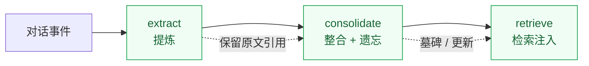

<a id="readme-top"></a>

<div align="center">

# TaleAI

**对外单一人格 · 内部多智能体协作**

一个正在长成的数字生命 —— 对外始终是同一个人「塔利」：稳定的人格、跨会话的记忆、能主动做事；内部则是一支按需拆解、分派、审核、收尾的团队。

<sub>`Python 3.11+` &nbsp;·&nbsp; `XML + 原生 FC 双通道`</sub>

</div>

---

<details>
<summary><b>目录</b></summary>

<br>

- [理念](#理念)
  - [七条设计原则](#七条设计原则) &nbsp;·&nbsp; [三个不变量](#三个不变量) &nbsp;·&nbsp; [六个框架取舍](#六个框架取舍)
- [架构](#架构)
  - [四层拓扑](#四层拓扑) &nbsp;·&nbsp; [双通道](#双通道人格说话工具干活) &nbsp;·&nbsp; [一次对话的旅程](#一次对话的旅程)
  - [三个 LLM 封顶](#前台与后台三个-llm-封顶) &nbsp;·&nbsp; [记忆](#记忆会忘但忘得可审计)
- [代码结构](#代码结构与架构的对应)

</details>

---

## 理念

### 七条设计原则

> [!NOTE]
> 前三项是**核心**，后四项是**辅助**。

| | 原则 | 含义 |
|:---:|---|---|
| **1** | **KISS** | 能简单绝不复杂，一个功能先做最小可用版本 |
| **2** | **可读性优先** | 代码是给未来的自己看的；命名直白、注释写人话，宁可慢一点也要看得懂 |
| **3** | **YAGNI** | 现在用不到的就不写；插件市场、遥测、生态一律砍到以后 |
| 4 | 文件优先 | 能落盘的状态就落盘，不依赖内存，崩溃能从磁盘重建 |
| 5 | 约定大于配置 | 目录结构本身就是约定，少写配置文件 |
| 6 | 单一职责 | 一个模块只干一件事，说话与执行互不越界 |
| 7 | 失败可恢复 | 任何崩溃都能从磁盘重建；检查点 + 追加日志兜底 |

### 三个不变量

不管功能怎么加，这三条不能破。

**① 控制流沿调用链走，总线只做旁路通知。**

一次对话顺着「适配器 → 路由 → 人格 → 工具」这条链一路调用下去；事件总线只在旁边发通知，**绝不反过来驱动控制流**。

**② 模型不自己决定「看什么」。**

每个模型的上下文由纯代码的装配器拼好再喂进去，模型只负责生成。让模型「自觉去查」不可靠，而装配是确定性工程 —— 可测、可控、可缓存。

**③ 权限不经过模型。**

插件声明要什么权限 → 执行前纯代码硬查 → 模型能看到的工具列表里**根本没有**改权限的入口。防提示词注入、防自授权。

### 六个框架取舍

> [!NOTE]
> TaleAI 不发明新算法，创新在**框架层面的取舍**。

| | 关键选择 | 为什么 |
|:---:|---|---|
| **1** | 人格输出（XML）与工具调用（原生 FC）**双通道分离，不做转换层** | 人格语言和工具指令是两类任务；FC 有原生训练支撑，自然语言模拟不了 |
| **2** | 上下文管理交给**纯代码装配器**，不新增一个上下文 LLM | 「模型自觉查」不可靠；装配是确定性的，纯代码可测可控可缓存 |
| **3** | 记忆是**事件追加 + 提炼 + 显式衰减遗忘**（半衰期 + 墓碑） | 记忆要会忘，但遗忘必须可审计、可恢复，不能靠反复总结悄悄丢信息 |
| **4** | 公共清单（tasks / decisions / notes）作为团队的**唯一事实源** | 多智能体需要一个共享的、落盘的真相，而不是互相喊话 |
| **5** | 权限三件套：**声明 + 硬拦 + 无自授权工具** | 权限判断不过模型 |
| **6** | 双形态：**临时 subagent + 常驻 Agent Team**（内建规划师） | 人格壳要轻、快、稳；规划脑要重、深、慢，二者必须分开 |

<p align="right">(<a href="#readme-top">回到顶部</a>)</p>

---

## 架构

### 四层拓扑



> [!NOTE]
> **实线** = 控制与请求　**虚线** = 事件通知 / 后台协作　**圆柱** = 落盘事实源。
>
> 队列只是门铃，**任务本体永远在圆柱体里** —— 总线只「推」通知，各消费者从磁盘按游标「取」。

### 双通道：人格说话，工具干活

ChatLLM 一次输出两样东西，两者并行、各管各的：

| 通道 | 管什么 | 内容 |
|---|---|---|
| **XML** | 说话 | 消息、表情、跨会话标签 —— 承载人格 |
| **原生 FC** | 干活 | 工具名 + 参数 —— 交给执行器 |

中间不加任何「翻译层」。人格就人格地说，工具就工具地调。

### 一次对话的旅程



> [!TIP]
> 用户消息**收即存**；模型看到什么由装配器决定；工具循环有上限、同工具同参数连续两次即熔断，保证不会死循环。

### 前台与后台：三个 LLM 封顶

| 角色 | 位置 | 职责 |
|---|---|---|
| **ChatLLM** | 前台 | 对话的人格壳 —— 要快、要稳 |
| **MemoryLLM** | 后台异步 | 记忆的提炼、整合、遗忘 |
| **PlanLLM** | 后台异步 | 作息与主动行为 |

种类**封顶 3 个**，不再新增。需要「语言压缩」交给后台兼职，需要「决定看什么」一律走纯代码 —— 避免为每个新需求都加一个 LLM。

### 记忆：会忘，但忘得可审计



每条记忆带**重要度、原文引用、最近访问时间**。软衰减按半衰期（默认 30 天）自然沉底；硬遗忘给低分老记忆打**墓碑**。

> [!IMPORTANT]
> **事件原文永存** —— 遗忘可审计、可恢复，禁止「总结的总结」。

<p align="right">(<a href="#readme-top">回到顶部</a>)</p>

---

## 代码结构与架构的对应

```
main.py                     入口：前台控制流、CLI、装配
src/core/
├── adapter/                接入层：统一消息模型 + 各平台适配器
│   ├── websocket/          └─ WebUI 接入
│   └── qq/                 └─ QQ 接入
├── llm/                    前台主链路
│   ├── prompts/            └─ 人格与提示词静态块
│   └── ...                 └─ 人格组装、上下文装配、ChatLLM 主循环
├── session/                事实源：会话 / 游标存储（SQLite + WAL）
├── plugin/                 工具链：注册表 + 权限守卫 + 内置插件
├── executor.py             工具执行
├── xml_parser.py           人格输出解析
├── config/                 配置系统（5 域 JSON）
├── bus/                    事件总线（旁路通知，不驱动控制流）
└── log.py                  日志
tests/                      测试，与 src 逐模块对应
webui/                      WebUI 静态页
data/                       运行时数据（不进仓库）
```

> [!NOTE]
> 模块间 import **单向**：适配器认识路由与总线，但**不认识 ChatLLM 内部**。

<p align="right">(<a href="#readme-top">回到顶部</a>)</p>

---

<div align="center">
<sub>架构设计说明书与实施计划属本地工作文档，不随仓库分发；正文中的 <code>§编号</code> 指向该说明书，仅作内部追溯。</sub>
</div>
